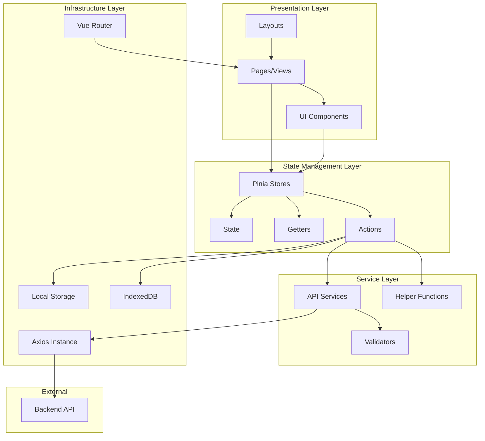
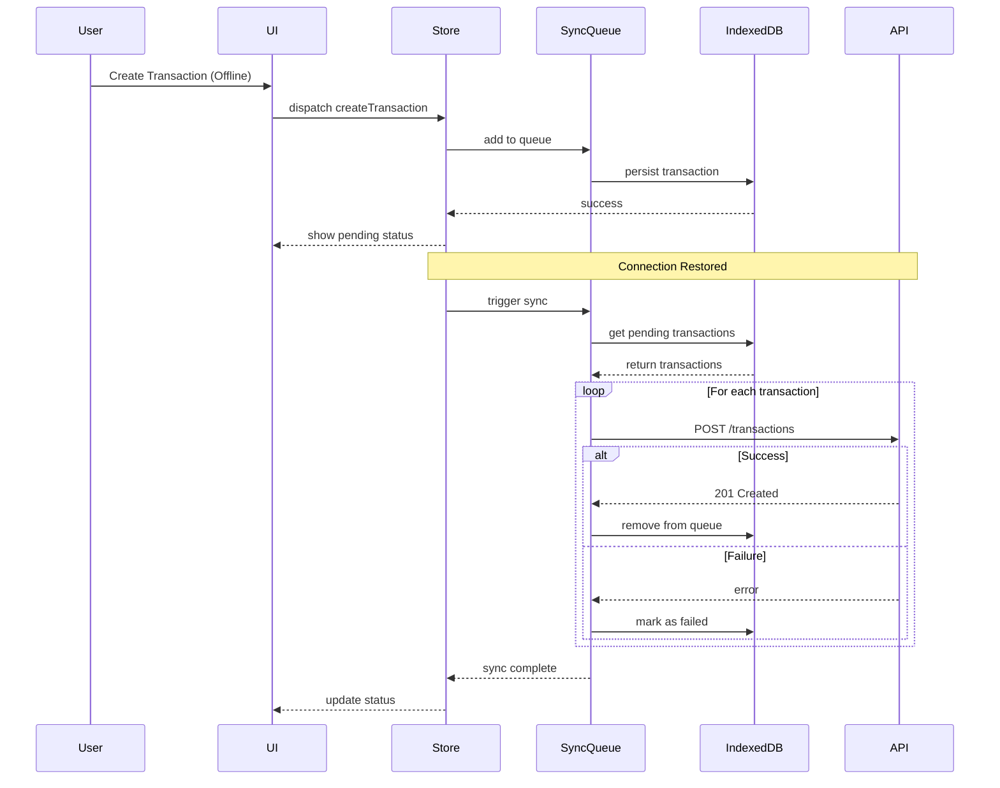

# UMKM-POS App - Design Document

## Overview

The UMKM-POS App is a Vue 3 + TypeScript frontend application that provides a comprehensive Point of Sale (POS) system for UMKM tourism businesses. The application follows a feature-based modular architecture with clear separation of concerns, enabling maintainability and scalability.

### Key Design Principles

1. **Feature-Based Modularity**: Each feature (auth, POS, dashboard, products, users, reports) is self-contained with its own components, stores, services, and routes
2. **Offline-First Architecture**: Support for offline transaction creation with automatic sync when connectivity is restored
3. **Type Safety**: Full TypeScript implementation with Zod for runtime validation
4. **State Management**: Pinia stores with separated state, getters, and actions for each module
5. **Component Reusability**: Shared UI components library for consistent user experience
6. **API Abstraction**: Centralized Axios configuration with interceptors for authentication and error handling

### Technology Stack

- **Framework**: Vue 3 (Composition API)
- **Build Tool**: Vite
- **Language**: TypeScript
- **State Management**: Pinia
- **UI Library**: PrimeVue 4.x
- **Styling**: Tailwind CSS 4.x + PrimeUI
- **HTTP Client**: Axios
- **Validation**: Zod
- **Charts**: Chart.js
- **Date Handling**: Day.js
- **Routing**: Vue Router 4

---

## Architecture

### High-Level Architecture



### Module Structure

Each feature module follows this consistent structure:

```
modules/
  {feature-name}/
    components/          # Feature-specific components
    pages/              # Route pages/views
    router/             # Route definitions
      index.ts
    services/           # API service layer
      api.ts            # API calls
      types.ts          # TypeScript types
      validators.ts     # Zod schemas
      constants.ts      # Constants
    stores/             # Pinia store
      index.ts          # Store configuration
      state.ts          # State definition
      getters.ts        # Computed values
      actions.ts        # Business logic
    helpers/            # Utility functions
    styles/             # Module-specific styles
    README.md           # Module documentation
```

### Offline Sync Architecture



---

## Components and Interfaces

### Core Modules

#### 1. Authentication Module

**Purpose**: Handle user authentication, session management, and authorization

**Components**:
- `LoginPage.vue`: Login form with email/password
- `ForgotPasswordPage.vue`: Password recovery
- `ResetPasswordPage.vue`: Password reset form

**Store Interface**:
```typescript
interface AuthState {
  user: User | null;
  token: string | null;
  isAuthenticated: boolean;
  loading: boolean;
  error: string | null;
}

interface AuthActions {
  login(credentials: LoginCredentials): Promise<void>;
  logout(): Promise<void>;
  refreshToken(): Promise<void>;
  checkAuth(): Promise<boolean>;
}
```

**API Service**:
```typescript
interface AuthAPI {
  login(email: string, password: string): Promise<AuthResponse>;
  logout(): Promise<void>;
  refreshToken(token: string): Promise<TokenResponse>;
  getCurrentUser(): Promise<User>;
}
```

#### 2. POS Terminal Module

**Purpose**: Handle transaction creation, cart management, and payment processing

**Components**:
- `POSTerminal.vue`: Main POS interface
- `ProductGrid.vue`: Product selection grid
- `ProductCard.vue`: Individual product display
- `Cart.vue`: Shopping cart display
- `CartItem.vue`: Individual cart item
- `PaymentDialog.vue`: Payment method selection
- `ReceiptPreview.vue`: Transaction receipt
- `ShiftManager.vue`: Shift start/end controls

**Store Interface**:
```typescript
interface POSState {
  cart: CartItem[];
  products: Product[];
  currentShift: Shift | null;
  selectedPaymentMethod: PaymentMethod | null;
  loading: boolean;
  error: string | null;
}

interface POSActions {
  addToCart(product: Product, quantity: number): void;
  removeFromCart(productId: string): void;
  updateCartItemQuantity(productId: string, quantity: number): void;
  clearCart(): void;
  createTransaction(payment: PaymentInfo): Promise<Transaction>;
  voidTransaction(transactionId: string, reason: string): Promise<void>;
  startShift(): Promise<Shift>;
  endShift(): Promise<ShiftSummary>;
}

interface POSGetters {
  cartTotal: number;
  cartItemCount: number;
  canCheckout: boolean;
  currentShiftDuration: number;
}
```

**API Service**:
```typescript
interface POSAPI {
  getProducts(filters?: ProductFilters): Promise<Product[]>;
  createTransaction(data: TransactionCreate): Promise<Transaction>;
  voidTransaction(id: string, reason: string): Promise<void>;
  startShift(): Promise<Shift>;
  endShift(shiftId: string): Promise<ShiftSummary>;
}
```

#### 3. Dashboard Module

**Purpose**: Display business metrics, analytics, and key performance indicators

**Components**:
- `DashboardOverview.vue`: Main dashboard page
- `SalesMetricCard.vue`: Metric display card
- `SalesChart.vue`: Sales trend chart
- `TopProductsList.vue`: Best-selling products
- `RecentTransactions.vue`: Latest transactions
- `DateRangeFilter.vue`: Time period selector
- `OutletFilter.vue`: Outlet selector

**Store Interface**:
```typescript
interface DashboardState {
  metrics: DashboardMetrics | null;
  salesData: SalesData[];
  topProducts: ProductSales[];
  recentTransactions: Transaction[];
  dateRange: DateRange;
  selectedOutlet: string | null;
  loading: boolean;
}

interface DashboardActions {
  fetchMetrics(dateRange: DateRange, outlet?: string): Promise<void>;
  fetchSalesData(dateRange: DateRange, outlet?: string): Promise<void>;
  fetchTopProducts(dateRange: DateRange, outlet?: string): Promise<void>;
  fetchRecentTransactions(limit: number): Promise<void>;
  setDateRange(range: DateRange): void;
  setOutlet(outletId: string): void;
}
```

#### 4. Transaction Management Module

**Purpose**: View, search, and manage transaction history

**Components**:
- `TransactionList.vue`: Transaction table with filters
- `TransactionDetail.vue`: Detailed transaction view
- `TransactionFilters.vue`: Search and filter controls
- `TransactionStatusBadge.vue`: Status indicator

**Store Interface**:
```typescript
interface TransactionState {
  transactions: Transaction[];
  selectedTransaction: Transaction | null;
  filters: TransactionFilters;
  pagination: Pagination;
  loading: boolean;
}

interface TransactionActions {
  fetchTransactions(filters?: TransactionFilters): Promise<void>;
  fetchTransactionById(id: string): Promise<void>;
  searchTransactions(query: string): Promise<void>;
  applyFilters(filters: TransactionFilters): void;
  clearFilters(): void;
}
```

#### 5. Product Management Module

**Purpose**: Manage product catalog, inventory, and stock adjustments

**Components**:
- `ProductList.vue`: Product table with CRUD operations
- `ProductForm.vue`: Create/edit product form
- `ProductDetail.vue`: Product information display
- `StockAdjustmentDialog.vue`: Stock adjustment form
- `StockAuditLog.vue`: Stock history table
- `CategoryFilter.vue`: Category selector

**Store Interface**:
```typescript
interface ProductState {
  products: Product[];
  selectedProduct: Product | null;
  categories: Category[];
  stockLog: StockLogEntry[];
  filters: ProductFilters;
  loading: boolean;
}

interface ProductActions {
  fetchProducts(filters?: ProductFilters): Promise<void>;
  createProduct(data: ProductCreate): Promise<Product>;
  updateProduct(id: string, data: ProductUpdate): Promise<Product>;
  deleteProduct(id: string): Promise<void>;
  adjustStock(productId: string, adjustment: StockAdjustment): Promise<void>;
  fetchStockLog(productId: string): Promise<void>;
}
```

#### 6. User Management Module

**Purpose**: Manage users, roles, and permissions

**Components**:
- `UserList.vue`: User table with CRUD operations
- `UserForm.vue`: Create/edit user form
- `UserDetail.vue`: User information display
- `PermissionManager.vue`: Permission assignment interface
- `RoleSelector.vue`: Role selection dropdown

**Store Interface**:
```typescript
interface UserState {
  users: User[];
  selectedUser: User | null;
  roles: Role[];
  permissions: Permission[];
  filters: UserFilters;
  loading: boolean;
}

interface UserActions {
  fetchUsers(filters?: UserFilters): Promise<void>;
  createUser(data: UserCreate): Promise<User>;
  updateUser(id: string, data: UserUpdate): Promise<User>;
  deactivateUser(id: string): Promise<void>;
  activateUser(id: string): Promise<void>;
  assignPermissions(userId: string, permissions: string[]): Promise<void>;
}
```

#### 7. Reports Module

**Purpose**: Generate and display business reports and analytics

**Components**:
- `DailyReport.vue`: Daily sales report
- `SalesAnalytics.vue`: Sales analytics with charts
- `StockReport.vue`: Inventory report
- `ReportFilters.vue`: Report filter controls
- `ExportButton.vue`: Export functionality

**Store Interface**:
```typescript
interface ReportState {
  dailyReport: DailyReport | null;
  salesAnalytics: SalesAnalytics | null;
  stockReport: StockReport | null;
  filters: ReportFilters;
  loading: boolean;
}

interface ReportActions {
  fetchDailyReport(date: Date, outlet?: string): Promise<void>;
  fetchSalesAnalytics(dateRange: DateRange, outlet?: string): Promise<void>;
  fetchStockReport(filters?: StockFilters): Promise<void>;
  exportReport(type: ReportType, format: ExportFormat): Promise<Blob>;
}
```

#### 8. Offline Sync Module

**Purpose**: Manage offline transaction queue and synchronization

**Components**:
- `SyncStatus.vue`: Sync status indicator
- `SyncQueue.vue`: Pending transactions list
- `SyncProgress.vue`: Sync progress indicator
- `OfflineIndicator.vue`: Network status display

**Store Interface**:
```typescript
interface SyncState {
  queue: QueuedTransaction[];
  isOnline: boolean;
  isSyncing: boolean;
  lastSyncTime: Date | null;
  syncErrors: SyncError[];
}

interface SyncActions {
  addToQueue(transaction: TransactionCreate): Promise<void>;
  syncQueue(): Promise<SyncResult>;
  retryFailed(): Promise<void>;
  clearQueue(): Promise<void>;
  handleConflict(transaction: QueuedTransaction, resolution: ConflictResolution): Promise<void>;
}
```

### Shared Components

**UI Components** (located in `src/components/`):
- `UiCard.vue`: Card container
- `UiCardHeader.vue`: Card header with title
- `UiFormGroup.vue`: Form field wrapper
- `UiSearch.vue`: Search input
- `UiAdvanceFilter.vue`: Advanced filter panel
- `UiConfirmDialog.vue`: Confirmation dialog
- `UiToast.vue`: Toast notification
- `UiSwitch.vue`: Toggle switch
- `UiPercentage.vue`: Percentage display
- `UiWrapIcon.vue`: Icon wrapper
- `UiSidebarMenu.vue`: Sidebar navigation
- `UiSidebarMenuItem.vue`: Menu item
- `UiSidebarProfile.vue`: User profile in sidebar

---

## Data Models

### Core Entities

#### User
```typescript
interface User {
  id: string;
  email: string;
  name: string;
  role: UserRole;
  outletId: string;
  outlet?: Outlet;
  status: UserStatus;
  permissions: string[];
  lastLogin: Date | null;
  createdAt: Date;
  updatedAt: Date;
}

enum UserRole {
  CASHIER = 'cashier',
  ADMIN = 'admin',
  MERCHANT = 'merchant'
}

enum UserStatus {
  ACTIVE = 'active',
  INACTIVE = 'inactive'
}
```

#### Product
```typescript
interface Product {
  id: string;
  merchantId: string;
  outletId: string;
  name: string;
  description: string | null;
  categoryId: string;
  category?: Category;
  price: number;
  cost: number;
  stock: number;
  sku: string | null;
  imageUrl: string | null;
  status: ProductStatus;
  createdAt: Date;
  updatedAt: Date;
}

enum ProductStatus {
  ACTIVE = 'active',
  INACTIVE = 'inactive'
}

interface Category {
  id: string;
  name: string;
  description: string | null;
}
```

#### Transaction
```typescript
interface Transaction {
  id: string;
  merchantId: string;
  outletId: string;
  userId: string;
  user?: User;
  shiftId: string | null;
  shift?: Shift;
  items: TransactionItem[];
  subtotal: number;
  tax: number;
  discount: number;
  total: number;
  paymentMethod: PaymentMethod;
  status: TransactionStatus;
  voidedAt: Date | null;
  voidedBy: string | null;
  voidReason: string | null;
  createdAt: Date;
  updatedAt: Date;
}

interface TransactionItem {
  id: string;
  transactionId: string;
  productId: string;
  product?: Product;
  productName: string;
  productPrice: number;
  quantity: number;
  subtotal: number;
}

enum TransactionStatus {
  COMPLETED = 'completed',
  VOIDED = 'voided',
  PENDING_SYNC = 'pending_sync'
}

enum PaymentMethod {
  CASH = 'cash',
  CARD = 'card',
  DIGITAL_WALLET = 'digital_wallet',
  BANK_TRANSFER = 'bank_transfer'
}
```

#### Cart
```typescript
interface CartItem {
  product: Product;
  quantity: number;
  subtotal: number;
}

interface Cart {
  items: CartItem[];
  subtotal: number;
  tax: number;
  discount: number;
  total: number;
}
```

#### Shift
```typescript
interface Shift {
  id: string;
  userId: string;
  user?: User;
  outletId: string;
  startTime: Date;
  endTime: Date | null;
  status: ShiftStatus;
  createdAt: Date;
  updatedAt: Date;
}

enum ShiftStatus {
  ACTIVE = 'active',
  CLOSED = 'closed'
}

interface ShiftSummary {
  shift: Shift;
  transactionCount: number;
  totalSales: number;
  cashSales: number;
  cardSales: number;
  digitalWalletSales: number;
}
```

#### Stock Adjustment
```typescript
interface StockAdjustment {
  type: StockAdjustmentType;
  quantity: number;
  reason: string | null;
}

enum StockAdjustmentType {
  ADD = 'add',
  REDUCE = 'reduce',
  SET = 'set'
}

interface StockLogEntry {
  id: string;
  productId: string;
  type: StockLogType;
  quantityBefore: number;
  quantityAfter: number;
  quantityChange: number;
  reason: string | null;
  userId: string;
  user?: User;
  createdAt: Date;
}

enum StockLogType {
  ADJUSTMENT = 'adjustment',
  SALE = 'sale',
  VOID = 'void',
  INITIAL = 'initial'
}
```

#### Offline Sync
```typescript
interface QueuedTransaction {
  id: string; // Local ID
  data: TransactionCreate;
  status: QueueStatus;
  attempts: number;
  lastAttempt: Date | null;
  error: string | null;
  createdAt: Date;
}

enum QueueStatus {
  PENDING = 'pending',
  SYNCING = 'syncing',
  FAILED = 'failed',
  SYNCED = 'synced'
}

interface SyncResult {
  total: number;
  synced: number;
  failed: number;
  errors: SyncError[];
}

interface SyncError {
  transactionId: string;
  error: string;
  timestamp: Date;
}
```

#### Dashboard Metrics
```typescript
interface DashboardMetrics {
  todaySales: number;
  todayTransactionCount: number;
  averageTransactionValue: number;
  topSellingProduct: ProductSales | null;
  lowStockCount: number;
}

interface ProductSales {
  product: Product;
  quantitySold: number;
  revenue: number;
}

interface SalesData {
  date: Date;
  sales: number;
  transactionCount: number;
}
```

### Validation Schemas

Using Zod for runtime validation:

```typescript
// Login validation
const loginSchema = z.object({
  email: z.string().email('Invalid email format'),
  password: z.string().min(6, 'Password must be at least 6 characters')
});

// Product validation
const productSchema = z.object({
  name: z.string().min(1, 'Name is required').max(255),
  categoryId: z.string().uuid('Invalid category'),
  description: z.string().max(1000).nullable(),
  price: z.number().positive('Price must be positive'),
  cost: z.number().nonnegative('Cost cannot be negative'),
  stock: z.number().int().nonnegative('Stock cannot be negative'),
  sku: z.string().max(100).nullable(),
  status: z.enum(['active', 'inactive'])
});

// Transaction validation
const transactionCreateSchema = z.object({
  items: z.array(z.object({
    productId: z.string().uuid(),
    quantity: z.number().int().positive()
  })).min(1, 'At least one item required'),
  paymentMethod: z.enum(['cash', 'card', 'digital_wallet', 'bank_transfer']),
  shiftId: z.string().uuid().nullable()
});

// Stock adjustment validation
const stockAdjustmentSchema = z.object({
  type: z.enum(['add', 'reduce', 'set']),
  quantity: z.number().int().positive('Quantity must be positive'),
  reason: z.string().max(500).nullable()
});

// User validation
const userCreateSchema = z.object({
  email: z.string().email('Invalid email'),
  name: z.string().min(1, 'Name is required').max(255),
  password: z.string().min(8, 'Password must be at least 8 characters'),
  role: z.enum(['cashier', 'admin', 'merchant']),
  outletId: z.string().uuid('Invalid outlet')
});
```

---

## Correctness Properties

A property is a characteristic or behavior that should hold true across all valid executions of a system—essentially, a formal statement about what the system should do. Properties serve as the bridge between human-readable specifications and machine-verifiable correctness guarantees.

### Authentication & Authorization Properties

**Property 1: Email Validation**
*For any* string input to the email field, only strings matching valid email format should be accepted by the validation function
**Validates: Requirements 1.1**

**Property 2: Login Button State**
*For any* combination of email and password field states (empty/filled), the login button should be disabled if and only if either field is empty
**Validates: Requirements 1.1**

**Property 3: Token Storage on Login**
*For any* successful login response containing a JWT token, the token should be stored in secure storage and retrievable after storage
**Validates: Requirements 1.1**

**Property 4: Role-Based Routing**
*For any* authenticated user with a specific role (cashier/admin/merchant), the redirect destination after login should match the role's designated dashboard route
**Validates: Requirements 1.1**

**Property 5: Error Display for Invalid Credentials**
*For any* login attempt with invalid credentials, an error message should be displayed to the user
**Validates: Requirements 1.1**

**Property 6: Loading State During Authentication**
*For any* authentication API call, a loading indicator should be visible from request start until response completion
**Validates: Requirements 1.1**

**Property 7: Token Persistence**
*For any* stored authentication token, the token should remain in storage after page refresh until explicitly removed
**Validates: Requirements 1.1**

**Property 8: Logout Token Cleanup**
*For any* authenticated session, executing logout should clear the JWT token from storage completely
**Validates: Requirements 1.2**

**Property 9: Logout Redirect**
*For any* logout action, the user should be redirected to the login page
**Validates: Requirements 1.2**

**Property 10: Protected Route Access After Logout**
*For any* protected route, attempting to access it after logout should redirect to the login page
**Validates: Requirements 1.2**

**Property 11: State Cleanup on Logout**
*For any* user-related state in the application, all user data should be cleared (set to null or empty) after logout
**Validates: Requirements 1.2**

**Property 12: Expired Token Handling**
*For any* API request with an expired token, the system should automatically trigger logout
**Validates: Requirements 1.3**

**Property 13: 401 Response Handling**
*For any* API response with 401 status code, the user should be redirected to the login page
**Validates: Requirements 1.3**

### POS Terminal Properties

**Property 14: Product Display Completeness**
*For any* product in the product list, all required fields (image, name, price, stock level) should be rendered in the UI
**Validates: Requirements 2.1**

**Property 15: Product Search Filtering**
*For any* search query string, the filtered product list should contain only products whose name or category matches the query
**Validates: Requirements 2.1**

**Property 16: Quantity Input Validation**
*For any* input to the quantity field, only positive integer values should be accepted
**Validates: Requirements 2.1**

**Property 17: Add to Cart Operation**
*For any* product and positive quantity, adding to cart should increase the cart item count
**Validates: Requirements 2.1**

**Property 18: Cart Total Calculation**
*For any* cart state, the total should equal the sum of (quantity × price) for all items in the cart
**Validates: Requirements 2.1**

**Property 19: Cart Item Mutation**
*For any* cart item, editing quantity or removing the item should update the cart state correctly
**Validates: Requirements 2.1**

**Property 20: Stock Reduction on Transaction**
*For any* completed transaction, each product's stock should be reduced by the quantity sold in that transaction
**Validates: Requirements 2.1**

**Property 21: Cart Cleanup After Transaction**
*For any* successful transaction, the cart should be empty immediately after completion
**Validates: Requirements 2.1**

**Property 22: Stock Availability Validation**
*For any* product and requested quantity, the system should reject the addition to cart if quantity exceeds available stock
**Validates: Requirements 2.2**

**Property 23: Maximum Quantity Constraint**
*For any* product, the maximum allowed quantity input should equal the product's available stock
**Validates: Requirements 2.2**

**Property 24: Cart Item Display**
*For any* item in the cart, the display should show quantity, price, and subtotal
**Validates: Requirements 2.3**

**Property 25: Cart Edit Validation**
*For any* cart item quantity edit, the new quantity cannot exceed the product's available stock
**Validates: Requirements 2.3**

**Property 26: Reactive Total Updates**
*For any* change to cart items (add, remove, edit quantity), the cart total should update immediately to reflect the change
**Validates: Requirements 2.3**

**Property 27: Cart Item Removal**
*For any* cart item, removing it should decrease the cart item count by one
**Validates: Requirements 2.3**

**Property 28: Void Button Visibility**
*For any* transaction, the void button should be visible if and only if the transaction status is "completed" (not already voided)
**Validates: Requirements 2.4**

**Property 29: Void Audit Logging**
*For any* void action, a log entry should be created containing the user ID, timestamp, and void reason
**Validates: Requirements 2.4**

**Property 30: Stock Restoration on Void**
*For any* voided transaction, each product's stock should be increased by the quantity that was sold in that transaction
**Validates: Requirements 2.4**

**Property 31: Void Status Update**
*For any* transaction that is voided, the transaction status should be set to "VOIDED"
**Validates: Requirements 2.4**

**Property 32: Void Idempotence**
*For any* transaction with status "VOIDED", attempting to void it again should be rejected
**Validates: Requirements 2.4**

**Property 33: Shift Button Visibility**
*For any* user state, the "Start Shift" button should be visible if and only if there is no active shift for that user
**Validates: Requirements 2.5**

**Property 34: Shift Start Time Recording**
*For any* shift start action, the shift record should contain a start time equal to the time the action was executed
**Validates: Requirements 2.5**

**Property 35: Shift End Time Recording**
*For any* shift end action, the shift record should contain an end time equal to the time the action was executed
**Validates: Requirements 2.5**

**Property 36: Transaction-Shift Linking**
*For any* transaction created during an active shift, the transaction should reference that shift's ID
**Validates: Requirements 2.5**

**Property 37: Shift Transaction Count Accuracy**
*For any* shift, the transaction count in the shift summary should equal the number of transactions linked to that shift
**Validates: Requirements 2.5**

**Property 38: Shift Total Sales Accuracy**
*For any* shift, the total sales in the shift summary should equal the sum of all transaction totals linked to that shift
**Validates: Requirements 2.5**

**Property 39: Single Active Shift Constraint**
*For any* user, attempting to start a new shift while an active shift exists should be rejected
**Validates: Requirements 2.5**

### Dashboard Properties

**Property 40: Sales Metrics Accuracy**
*For any* date and outlet selection, the displayed sales metrics should match the sum of all transactions for that date and outlet
**Validates: Requirements 3.1**

**Property 41: Top Products Ranking**
*For any* dataset of product sales, the top products list should be sorted in descending order by quantity sold or revenue
**Validates: Requirements 3.1**

**Property 42: Chart Rendering Stability**
*For any* valid sales data array, the chart component should render without throwing errors
**Validates: Requirements 3.1**

**Property 43: Time Period Filtering**
*For any* selected time period (today, week, month), the displayed data should include only transactions within that time range
**Validates: Requirements 3.1**

### Transaction Management Properties

**Property 44: Transaction Display Completeness**
*For any* transaction in the transaction list, all required fields (ID, date, amount, status) should be rendered
**Validates: Requirements 4.1**

**Property 45: Pagination Calculation**
*For any* total item count and page size, the number of pages should equal ceil(total / pageSize)
**Validates: Requirements 4.1**

**Property 46: Transaction ID Search**
*For any* search query, the filtered transaction list should contain only transactions whose ID matches the query
**Validates: Requirements 4.1**

**Property 47: Date Range Filtering**
*For any* date range (start, end), the filtered transaction list should contain only transactions with createdAt between start and end
**Validates: Requirements 4.1**

**Property 48: Status Filtering**
*For any* selected status, the filtered transaction list should contain only transactions with that status
**Validates: Requirements 4.1**

**Property 49: Column Sorting**
*For any* sortable column and sort direction, the transaction list should be ordered by that column in the specified direction
**Validates: Requirements 4.1**

**Property 50: Transaction Detail Accuracy**
*For any* transaction, the detail view should display all transaction data exactly as stored in the database
**Validates: Requirements 4.2**

**Property 51: Price Snapshot Integrity**
*For any* transaction item, the displayed price should be the price at the time of transaction, not the current product price
**Validates: Requirements 4.2**

**Property 52: Multiple Filter Composition**
*For any* combination of filters (date range, status, search), the result should include only transactions matching all applied filters
**Validates: Requirements 4.3**

**Property 53: Reactive Filter Updates**
*For any* filter change, the transaction list should update immediately to reflect the new filter criteria
**Validates: Requirements 4.3**

**Property 54: Filter Reset**
*For any* active filters, clicking "Clear filters" should reset all filters to their initial state and display all transactions
**Validates: Requirements 4.3**

### Product Management Properties

**Property 55: Product List Display Completeness**
*For any* product in the product list, all fields (name, category, price, cost, stock, status) should be rendered
**Validates: Requirements 5.1**

**Property 56: Product Name Search**
*For any* search query, the filtered product list should contain only products whose name contains the query string
**Validates: Requirements 5.1**

**Property 57: Category Filtering**
*For any* selected category, the filtered product list should contain only products belonging to that category
**Validates: Requirements 5.1**

**Property 58: Product Column Sorting**
*For any* sortable column and sort direction, the product list should be ordered by that column in the specified direction
**Validates: Requirements 5.1**

**Property 59: Product Form Required Field Validation**
*For any* product form submission, the form should be rejected if any required field (name, category, price, cost, stock) is empty
**Validates: Requirements 5.2**

**Property 60: Price Positivity Validation**
*For any* price or cost input, the validation should reject values less than or equal to zero
**Validates: Requirements 5.2**

**Property 61: Stock Non-Negativity Validation**
*For any* stock input, the validation should reject negative values
**Validates: Requirements 5.2**

**Property 62: Form Submit Button State**
*For any* product form state, the save button should be disabled if and only if the form has validation errors
**Validates: Requirements 5.2**

**Property 63: Product Creation Persistence**
*For any* successfully created product, the product should appear in the product list after creation
**Validates: Requirements 5.2**

**Property 64: Product Form Pre-fill**
*For any* product being edited, the form fields should be initialized with the product's current data
**Validates: Requirements 5.3**

**Property 65: Product Update Persistence**
*For any* successfully updated product, the changes should be visible in the product list after update
**Validates: Requirements 5.3**

**Property 66: Stock Adjustment Display**
*For any* product in the stock adjustment dialog, the current stock level should be displayed
**Validates: Requirements 5.4**

**Property 67: Stock Adjustment Quantity Validation**
*For any* stock adjustment quantity input, only positive integer values should be accepted
**Validates: Requirements 5.4**

**Property 68: Stock Update Application**
*For any* stock adjustment, the product's stock should be updated according to the adjustment type (add increases, reduce decreases)
**Validates: Requirements 5.4**

**Property 69: Stock Adjustment Audit Log**
*For any* stock adjustment, a log entry should be created with the adjustment details, user, and timestamp
**Validates: Requirements 5.4**

**Property 70: Stock Non-Negativity Constraint**
*For any* stock reduction adjustment, the operation should be rejected if it would result in negative stock
**Validates: Requirements 5.4**

**Property 71: Stock Log Completeness**
*For any* product, the stock log should display all stock adjustment entries for that product
**Validates: Requirements 5.5**

**Property 72: Stock Log Entry Accuracy**
*For any* stock log entry, all fields (date, type, quantity, reason, user) should be displayed correctly
**Validates: Requirements 5.5**

### User Management Properties

**Property 73: User List Display Completeness**
*For any* user in the user list, all fields (name, email, role, outlet, status, last login) should be rendered
**Validates: Requirements 6.1**

**Property 74: User Search**
*For any* search query, the filtered user list should contain only users whose name or email contains the query string
**Validates: Requirements 6.1**

**Property 75: User Role Filtering**
*For any* selected role, the filtered user list should contain only users with that role
**Validates: Requirements 6.1**

**Property 76: User Form Required Field Validation**
*For any* user form submission, the form should be rejected if any required field (name, email, password, role, outlet) is empty
**Validates: Requirements 6.2**

**Property 77: Email Format Validation**
*For any* email input, the validation should reject strings that don't match valid email format
**Validates: Requirements 6.2**

**Property 78: Password Strength Validation**
*For any* password input, the validation should reject passwords shorter than 8 characters
**Validates: Requirements 6.2**

**Property 79: User Creation Persistence**
*For any* successfully created user, the user should appear in the user list after creation
**Validates: Requirements 6.2**

**Property 80: Password Optional on Update**
*For any* user update form, the form should be valid even if the password field is empty
**Validates: Requirements 6.3**

**Property 81: User Update Persistence**
*For any* successfully updated user, the changes should be visible in the user list after update
**Validates: Requirements 6.3**

**Property 82: Deactivate Button Visibility**
*For any* user, the deactivate button should be visible if and only if the user status is "active"
**Validates: Requirements 6.4**

**Property 83: User Deactivation Status Update**
*For any* user deactivation action, the user's status should be set to "inactive"
**Validates: Requirements 6.4**

**Property 84: Inactive User Login Prevention**
*For any* login attempt by a user with status "inactive", the login should be rejected
**Validates: Requirements 6.4**

**Property 85: User Reactivation**
*For any* user with status "inactive", the reactivate action should set the status to "active"
**Validates: Requirements 6.4**

**Property 86: Permission Pre-selection**
*For any* user in the permission manager, the user's current permissions should be pre-selected in the UI
**Validates: Requirements 6.5**

**Property 87: Permission Toggle**
*For any* permission, toggling it should add it to the user's permissions if not present, or remove it if present
**Validates: Requirements 6.5**

**Property 88: Permission Immediate Effect**
*For any* permission update, the new permissions should be reflected in the user's authorization checks immediately after save
**Validates: Requirements 6.5**

### Reports & Analytics Properties

**Property 89: Daily Report Date Accuracy**
*For any* selected date, the daily report should include only transactions with createdAt on that date
**Validates: Requirements 7.1**

**Property 90: Report Aggregation Accuracy**
*For any* dataset of transactions, the report totals (sales, transaction count) should match the sum and count of the transactions
**Validates: Requirements 7.1**

**Property 91: Analytics Chart Rendering**
*For any* valid analytics data, the charts should render without throwing errors
**Validates: Requirements 7.2**

**Property 92: Analytics Time Period Filtering**
*For any* selected time period (week, month, year), the analytics data should include only transactions within that time range
**Validates: Requirements 7.2**

**Property 93: Analytics Data Accuracy**
*For any* dataset of transactions, the analytics calculations should correctly aggregate the data
**Validates: Requirements 7.2**

**Property 94: Stock Report Accuracy**
*For any* product, the stock level in the report should match the product's current stock value
**Validates: Requirements 7.3**

**Property 95: Low Stock Highlighting**
*For any* product with stock below the low stock threshold, the product should be visually highlighted in the report
**Validates: Requirements 7.3**

### Offline Sync Properties

**Property 96: Offline Transaction Local Storage**
*For any* transaction created while offline, the transaction should be persisted to IndexedDB
**Validates: Requirements 8.1**

**Property 97: Offline Transaction Status**
*For any* transaction created while offline, the transaction status should be set to "pending_sync"
**Validates: Requirements 8.1**

**Property 98: Multiple Offline Transactions**
*For any* number of transactions created while offline, all transactions should be added to the sync queue
**Validates: Requirements 8.1**

**Property 99: Offline Stock Validation**
*For any* transaction created while offline, stock validation should use the locally cached product data
**Validates: Requirements 8.1**

**Property 100: Successful Sync Queue Removal**
*For any* queued transaction that syncs successfully, the transaction should be removed from the sync queue
**Validates: Requirements 8.2**

**Property 101: Failed Sync Queue Retention**
*For any* queued transaction that fails to sync, the transaction should remain in the sync queue with status "failed"
**Validates: Requirements 8.2**

**Property 102: Sync Retry Functionality**
*For any* failed transaction in the sync queue, the retry action should attempt to sync the transaction again
**Validates: Requirements 8.2**

**Property 103: Conflict Detection**
*For any* sync operation where local and server data differ, the system should detect the conflict
**Validates: Requirements 8.3**

**Property 104: Server-Authoritative Resolution**
*For any* detected conflict, the conflict resolution should use the server data as the authoritative source
**Validates: Requirements 8.3**

**Property 105: Sync Queue Status Accuracy**
*For any* sync queue state, the displayed status should accurately reflect the current queue state
**Validates: Requirements 8.4**

**Property 106: Pending Count Accuracy**
*For any* sync queue, the pending count should equal the number of transactions with status "pending" or "syncing"
**Validates: Requirements 8.4**

**Property 107: Failed Count Accuracy**
*For any* sync queue, the failed count should equal the number of transactions with status "failed"
**Validates: Requirements 8.4**

**Property 108: Queue Retry Operation**
*For any* failed transaction in the queue, clicking retry should change the status to "syncing" and attempt synchronization
**Validates: Requirements 8.4**

---

## Error Handling

### Error Categories

#### 1. Network Errors
- **Connection Timeout**: Display user-friendly message, suggest checking internet connection
- **Server Unavailable (5xx)**: Display maintenance message, enable offline mode if applicable
- **Request Failed**: Log error details, display generic error message to user

#### 2. Validation Errors
- **Client-Side Validation**: Display inline error messages next to form fields
- **Server-Side Validation**: Display error messages from API response
- **Type Errors**: Catch with Zod schemas, display field-specific errors

#### 3. Authentication Errors
- **401 Unauthorized**: Clear token, redirect to login, display session expired message
- **403 Forbidden**: Display permission denied message, suggest contacting administrator
- **Token Expired**: Attempt token refresh, fallback to logout if refresh fails

#### 4. Business Logic Errors
- **Insufficient Stock**: Display available quantity, prevent transaction
- **Duplicate Entry**: Display conflict message, suggest alternative action
- **Invalid State**: Display state-specific error, guide user to valid action

#### 5. Offline Sync Errors
- **Sync Conflict**: Display conflict details, apply server-authoritative resolution
- **Partial Sync Failure**: Display which transactions failed, enable retry
- **Queue Full**: Display warning, suggest syncing before continuing

### Error Handling Strategy

```typescript
// Global error handler in Axios interceptor
api.interceptors.response.use(
  (response) => response,
  (error) => {
    if (error.response) {
      // Server responded with error status
      switch (error.response.status) {
        case 401:
          handleUnauthorized();
          break;
        case 403:
          handleForbidden();
          break;
        case 422:
          handleValidationError(error.response.data);
          break;
        case 500:
          handleServerError();
          break;
        default:
          handleGenericError(error);
      }
    } else if (error.request) {
      // Request made but no response
      handleNetworkError();
    } else {
      // Error in request setup
      handleRequestError(error);
    }
    return Promise.reject(error);
  }
);
```

### User-Facing Error Messages

- **Network Error**: "Unable to connect to server. Please check your internet connection."
- **Session Expired**: "Your session has expired. Please log in again."
- **Permission Denied**: "You don't have permission to perform this action."
- **Validation Error**: Field-specific messages from validation schema
- **Insufficient Stock**: "Only {available} units available. Please adjust quantity."
- **Server Error**: "Something went wrong. Please try again later."

---

## Testing Strategy

### Dual Testing Approach

The application will use both unit testing and property-based testing to ensure comprehensive coverage:

- **Unit Tests**: Verify specific examples, edge cases, and error conditions
- **Property Tests**: Verify universal properties across all inputs

Both testing approaches are complementary and necessary. Unit tests catch concrete bugs in specific scenarios, while property tests verify general correctness across a wide range of inputs.

### Testing Framework

**Unit Testing**:
- Framework: Vitest
- Component Testing: Vue Test Utils
- Mocking: vi.mock() for API calls and stores

**Property-Based Testing**:
- Framework: fast-check (JavaScript/TypeScript property-based testing library)
- Configuration: Minimum 100 iterations per property test
- Each property test must reference its design document property

### Property Test Configuration

Each property-based test should:
1. Run a minimum of 100 iterations to ensure comprehensive input coverage
2. Include a comment tag referencing the design property
3. Use fast-check generators for input data
4. Verify the property holds for all generated inputs

**Tag Format**:
```typescript
// Feature: umkm-pos-app, Property 18: Cart Total Calculation
```

### Test Organization

```
modules/
  {feature-name}/
    __tests__/
      unit/
        components/
          ComponentName.spec.ts
        stores/
          actions.spec.ts
          getters.spec.ts
        services/
          api.spec.ts
          validators.spec.ts
      properties/
        cart-properties.spec.ts
        transaction-properties.spec.ts
        validation-properties.spec.ts
```

### Unit Test Coverage

**Components**:
- Rendering with different props
- User interactions (clicks, inputs)
- Conditional rendering based on state
- Event emissions
- Error states

**Stores**:
- Action success and failure paths
- Getter computed values
- State mutations
- Side effects (API calls, storage)

**Services**:
- API request/response handling
- Error handling
- Data transformation
- Validation logic

**Example Unit Test**:
```typescript
import { describe, it, expect, vi } from 'vitest';
import { mount } from '@vue/test-utils';
import ProductCard from '../ProductCard.vue';

describe('ProductCard', () => {
  it('displays product information correctly', () => {
    const product = {
      id: '1',
      name: 'Test Product',
      price: 10000,
      stock: 5
    };
    
    const wrapper = mount(ProductCard, {
      props: { product }
    });
    
    expect(wrapper.text()).toContain('Test Product');
    expect(wrapper.text()).toContain('10000');
    expect(wrapper.text()).toContain('5');
  });
  
  it('disables add button when out of stock', () => {
    const product = {
      id: '1',
      name: 'Test Product',
      price: 10000,
      stock: 0
    };
    
    const wrapper = mount(ProductCard, {
      props: { product }
    });
    
    const addButton = wrapper.find('[data-test="add-button"]');
    expect(addButton.attributes('disabled')).toBeDefined();
  });
});
```

### Property-Based Test Coverage

Each correctness property from the design document should have a corresponding property-based test.

**Example Property Test**:
```typescript
import { describe, it } from 'vitest';
import fc from 'fast-check';
import { calculateCartTotal } from '../cart-utils';

describe('Cart Properties', () => {
  // Feature: umkm-pos-app, Property 18: Cart Total Calculation
  it('cart total equals sum of item subtotals', () => {
    fc.assert(
      fc.property(
        fc.array(
          fc.record({
            quantity: fc.integer({ min: 1, max: 100 }),
            price: fc.integer({ min: 100, max: 1000000 })
          }),
          { minLength: 1, maxLength: 20 }
        ),
        (items) => {
          const cart = items.map(item => ({
            ...item,
            subtotal: item.quantity * item.price
          }));
          
          const expectedTotal = cart.reduce(
            (sum, item) => sum + item.subtotal,
            0
          );
          
          const actualTotal = calculateCartTotal(cart);
          
          return actualTotal === expectedTotal;
        }
      ),
      { numRuns: 100 }
    );
  });
  
  // Feature: umkm-pos-app, Property 22: Stock Availability Validation
  it('adding to cart is rejected when quantity exceeds stock', () => {
    fc.assert(
      fc.property(
        fc.record({
          stock: fc.integer({ min: 0, max: 100 }),
          requestedQuantity: fc.integer({ min: 1, max: 200 })
        }),
        ({ stock, requestedQuantity }) => {
          const product = { id: '1', name: 'Test', stock };
          const result = validateAddToCart(product, requestedQuantity);
          
          if (requestedQuantity > stock) {
            return result.valid === false;
          }
          return result.valid === true;
        }
      ),
      { numRuns: 100 }
    );
  });
});
```

### Integration Testing

**Scope**: Test interactions between multiple components and stores

**Examples**:
- Complete transaction flow (add to cart → checkout → payment)
- User authentication flow (login → token storage → route access)
- Offline sync flow (create offline → sync → verify server)

### E2E Testing (Optional for MVP)

**Scope**: Test complete user journeys in a browser environment

**Tools**: Playwright or Cypress

**Examples**:
- Cashier creates a transaction from start to finish
- Admin manages products and views reports
- User logs in, performs actions, and logs out

### Test Data Generators

Use fast-check arbitraries for generating test data:

```typescript
// Product generator
const productArbitrary = fc.record({
  id: fc.uuid(),
  name: fc.string({ minLength: 1, maxLength: 100 }),
  price: fc.integer({ min: 100, max: 10000000 }),
  cost: fc.integer({ min: 50, max: 5000000 }),
  stock: fc.integer({ min: 0, max: 1000 }),
  status: fc.constantFrom('active', 'inactive')
});

// Transaction generator
const transactionArbitrary = fc.record({
  id: fc.uuid(),
  items: fc.array(
    fc.record({
      productId: fc.uuid(),
      quantity: fc.integer({ min: 1, max: 10 }),
      price: fc.integer({ min: 100, max: 1000000 })
    }),
    { minLength: 1, maxLength: 10 }
  ),
  paymentMethod: fc.constantFrom('cash', 'card', 'digital_wallet'),
  status: fc.constantFrom('completed', 'voided', 'pending_sync')
});

// User generator
const userArbitrary = fc.record({
  id: fc.uuid(),
  email: fc.emailAddress(),
  name: fc.string({ minLength: 1, maxLength: 100 }),
  role: fc.constantFrom('cashier', 'admin', 'merchant'),
  status: fc.constantFrom('active', 'inactive')
});
```

### Continuous Integration

**Pre-commit**:
- Run linter (ESLint)
- Run type checker (vue-tsc)
- Run unit tests

**CI Pipeline**:
- Install dependencies
- Run linter
- Run type checker
- Run all unit tests
- Run all property tests
- Build application
- Report coverage

### Coverage Goals

- **Unit Test Coverage**: 80%+ for critical business logic
- **Property Test Coverage**: 100% of correctness properties
- **Component Coverage**: 70%+ for UI components
- **Store Coverage**: 90%+ for state management

---

## Performance Considerations

### Optimization Strategies

1. **Lazy Loading**: Load feature modules on-demand using Vue Router lazy loading
2. **Component Lazy Loading**: Use `defineAsyncComponent` for heavy components
3. **Virtual Scrolling**: Implement virtual scrolling for large lists (products, transactions)
4. **Debouncing**: Debounce search inputs to reduce API calls
5. **Caching**: Cache frequently accessed data (products, categories) in Pinia stores
6. **Image Optimization**: Use lazy loading and responsive images for product images
7. **Code Splitting**: Vite automatically splits code by routes

### IndexedDB for Offline Storage

```typescript
// IndexedDB schema
const DB_NAME = 'umkm-pos-db';
const DB_VERSION = 1;

const STORES = {
  TRANSACTIONS: 'transactions',
  PRODUCTS: 'products',
  SYNC_QUEUE: 'sync_queue'
};

// Initialize database
const initDB = (): Promise<IDBDatabase> => {
  return new Promise((resolve, reject) => {
    const request = indexedDB.open(DB_NAME, DB_VERSION);
    
    request.onerror = () => reject(request.error);
    request.onsuccess = () => resolve(request.result);
    
    request.onupgradeneeded = (event) => {
      const db = (event.target as IDBOpenDBRequest).result;
      
      // Create object stores
      if (!db.objectStoreNames.contains(STORES.TRANSACTIONS)) {
        db.createObjectStore(STORES.TRANSACTIONS, { keyPath: 'id' });
      }
      
      if (!db.objectStoreNames.contains(STORES.PRODUCTS)) {
        const productStore = db.createObjectStore(STORES.PRODUCTS, { keyPath: 'id' });
        productStore.createIndex('categoryId', 'categoryId', { unique: false });
      }
      
      if (!db.objectStoreNames.contains(STORES.SYNC_QUEUE)) {
        const queueStore = db.createObjectStore(STORES.SYNC_QUEUE, { keyPath: 'id' });
        queueStore.createIndex('status', 'status', { unique: false });
      }
    };
  });
};
```

### State Management Best Practices

1. **Normalize State**: Store entities by ID in objects, not arrays
2. **Computed Getters**: Use getters for derived state instead of duplicating data
3. **Action Composition**: Break complex actions into smaller, reusable actions
4. **Optimistic Updates**: Update UI immediately, rollback on error
5. **Selective Reactivity**: Use `shallowRef` for large objects that don't need deep reactivity

---

## Security Considerations

### Authentication & Authorization

1. **JWT Storage**: Store tokens in memory or httpOnly cookies (not localStorage for production)
2. **Token Refresh**: Implement automatic token refresh before expiration
3. **Route Guards**: Protect routes based on authentication and permissions
4. **Permission Checks**: Verify permissions before rendering UI elements and making API calls

### Input Validation

1. **Client-Side**: Validate all inputs with Zod schemas before submission
2. **Server-Side**: Always validate on server (never trust client)
3. **Sanitization**: Sanitize user inputs to prevent XSS
4. **Type Safety**: Use TypeScript to catch type errors at compile time

### API Security

1. **HTTPS Only**: All API calls must use HTTPS in production
2. **CORS**: Configure CORS properly on backend
3. **Rate Limiting**: Implement rate limiting on sensitive endpoints
4. **CSRF Protection**: Use CSRF tokens for state-changing operations

### Data Privacy

1. **Merchant Isolation**: All queries must filter by merchantId
2. **Outlet Scoping**: Users can only access data from their assigned outlet
3. **Audit Logging**: Log all sensitive operations (void, user changes, stock adjustments)
4. **PII Protection**: Never log sensitive user data

---

## Deployment

### Build Configuration

```typescript
// vite.config.ts
export default defineConfig({
  plugins: [vue()],
  build: {
    target: 'es2015',
    outDir: 'dist',
    assetsDir: 'assets',
    sourcemap: false,
    minify: 'terser',
    rollupOptions: {
      output: {
        manualChunks: {
          'vendor': ['vue', 'vue-router', 'pinia'],
          'ui': ['primevue'],
          'charts': ['chart.js']
        }
      }
    }
  }
});
```

### Environment Variables

```bash
# .env.production
VITE_API_BASE_URL=https://api.umkm-pos.com
VITE_APP_NAME=UMKM POS
VITE_APP_VERSION=1.0.0
```

### Docker Deployment

```dockerfile
# Dockerfile
FROM node:20-alpine as build
WORKDIR /app
COPY package*.json ./
RUN npm ci
COPY . .
RUN npm run build

FROM nginx:alpine
COPY --from=build /app/dist /usr/share/nginx/html
COPY default.conf /etc/nginx/conf.d/default.conf
EXPOSE 80
CMD ["nginx", "-g", "daemon off;"]
```

### Monitoring

1. **Error Tracking**: Integrate Sentry or similar for error monitoring
2. **Analytics**: Track user interactions and feature usage
3. **Performance**: Monitor page load times and API response times
4. **Uptime**: Monitor application availability

---

## Future Enhancements

1. **Progressive Web App (PWA)**: Add service worker for full offline support
2. **Multi-language Support**: Implement i18n for multiple languages
3. **Advanced Analytics**: Add more detailed business intelligence features
4. **Loyalty Program**: Integrate customer loyalty and rewards
5. **Inventory Forecasting**: Predict stock needs based on sales trends
6. **Mobile App**: Native mobile apps for iOS and Android
7. **Receipt Customization**: Allow merchants to customize receipt templates
8. **Tax Calculations**: Automatic tax calculation based on location
9. **Accounting Integration**: Export data to accounting software
10. **Multi-currency Support**: Support multiple currencies for international businesses

